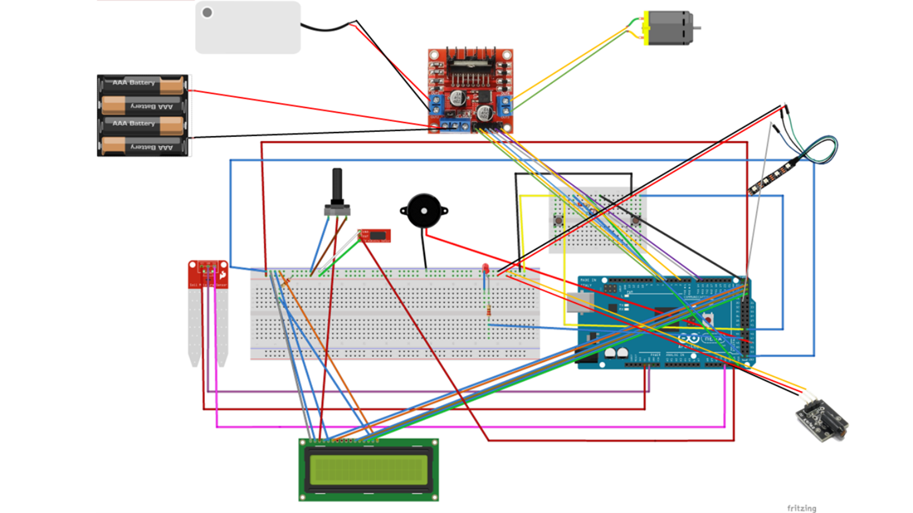

# 🌱 Smart Garden Embedded System

아두이노 기반으로 제작한 스마트 가든(Smart Garden) 시스템입니다.  
토양 수분, 온습도, 조도, 충격 센서를 활용하여 식물 환경을 모니터링하고,  
자동 급수/조명/환기/경고 기능을 제공합니다.  

---

## 📑 목차
- [✨ 주요 기능](#-주요-기능)
- [🖼 Wiring Diagram](#-wiring-diagram)
- [📦 부품 목록](#-부품-목록)
- [🔌 핀맵 (Pin Map)](#-핀맵-pin-map)
- [🚀 실행 방법](#-실행-방법)
- [📹 데모 영상](#-데모-영상)

---

## ✨ 주요 기능

1. **자동 급수**
   - 토양 습도 센서 값을 기반으로 워터 펌프 제어
   - 일정 수분 이하일 때 자동 급수

2. **환경 정보 표시**
   - LCD에 토양 습도, 온도, 습도, 조도 실시간 표시
   - 버튼 입력 시 자기소개 + 오늘 날씨 상태 멘트

3. **자동 조명**
   - 조도 센서가 어두움 감지 → 네오픽셀 LED 점등

4. **환기 / 바람 공급**
   - 버튼 입력 시 선풍기 작동 (씨앗 수정, CO₂ 공급용)

5. **보안 / 경고 시스템**
   - 충격 센서 감지 → 빨간 LED 점등 + 부저 경고음 발생

6. **소통 창구**
   - 버튼1을 누르면 LCD에 인사/온도 메시지 출력

---

## 🖼 Wiring Diagram

---

## 📦 부품 목록

프로젝트에 사용된 전체 부품 및 기능별 준비물은 [parts_list.md](./parts_list.md) 에 정리되어 있습니다.

---

## 🔌 핀맵 (Pin Map)

| 핀 번호 | 연결 부품 | 설명 |
|---------|-----------|------|
| A15 | 조도 센서 | 주변 밝기 감지 |
| A14 | DHT11 | 온도/습도 측정 |
| A13 | 충격 센서 | 진동/충격 감지 |
| A12 | 토양 습도 센서 | 토양 수분 측정 |
| 34  | NeoPixel | 자동 조명 제어 |
| 46  | RED LED | 경고등 |
| 47  | 부저 | 경고음 출력 |
| 7/6/5 | 워터 펌프 모터 | 모터 드라이버 제어 (PWM + 방향) |
| 2/14/15 | 선풍기 모터 | 모터 드라이버 제어 (PWM + 방향) |
| 42 | 버튼1 | 자기소개/날씨 표시 트리거 |
| 43 | 버튼2 | 선풍기 작동 트리거 |
| 22–27 | LCD | 데이터 및 제어핀 |

---

## 🚀 실행 방법

1. Arduino IDE 설치  
2. `SmartGarden.ino` 코드를 불러오기  
3. 필요한 라이브러리 설치:
   - `LiquidCrystal.h`
   - `DHT.h`
   - `Adafruit_NeoPixel.h`
4. 보드: **Arduino Mega 2560** 선택  
5. 업로드 후 시리얼 모니터(9600 baud)에서 센서값 확인 가능  

---

## 📹 데모 영상

---
